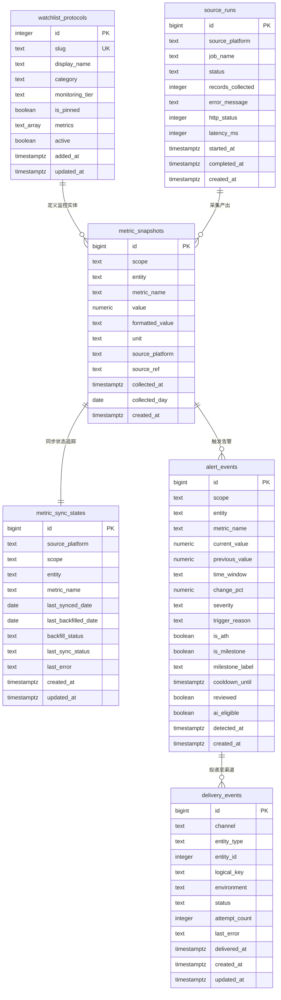
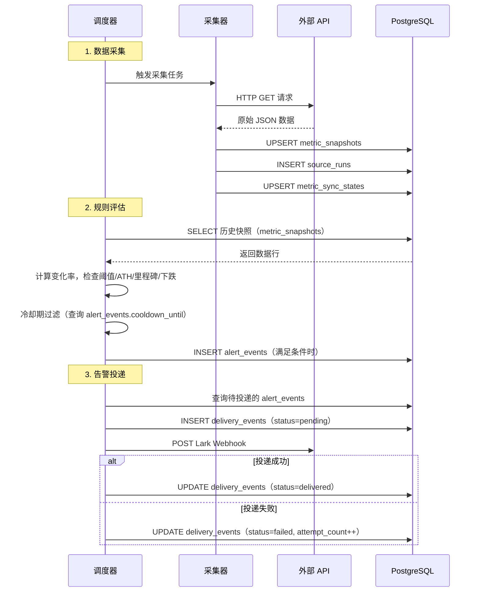

# 数据库结构规格说明

> 本文档是 Mantle Ecosystem Monitor 系统数据库的权威参考。
> 模型定义源码：`src/db/models.py` | 迁移脚本：`alembic/versions/` | 当前迁移版本：`0004`

---

## 1. 概览

| 项目 | 说明 |
|------|------|
| 生产数据库 | PostgreSQL 16（Docker 镜像 `postgres:16-alpine`） |
| 测试数据库 | SQLite（通过 `aiosqlite` 提供异步支持） |
| ORM | SQLAlchemy 2.0（async 模式，基于 `DeclarativeBase`） |
| 异步驱动 | `asyncpg`（PostgreSQL）/ `aiosqlite`（SQLite） |
| 迁移工具 | Alembic |
| 时间戳约定 | 所有时间字段均为 `TIMESTAMPTZ`（UTC） |

系统共包含 **6 张表**：

| 表名 | 用途 | 引入版本 |
|------|------|----------|
| `metric_snapshots` | 指标数据快照（核心事实表） | 0001 |
| `alert_events` | 告警事件记录 | 0001 |
| `watchlist_protocols` | 被监控的生态协议注册表 | 0001 |
| `source_runs` | 数据采集任务运行日志 | 0001 |
| `delivery_events` | 告警投递记录（Lark 等渠道） | 0002 |
| `metric_sync_states` | 指标同步状态追踪 | 0003 |

---

## 2. 实体关系图

> 系统不使用数据库级外键约束，所有关系均为逻辑关联，在应用层维护。

---

## 3. 表结构详解

### 3.1 `metric_snapshots` — 指标数据快照

系统的核心事实表。每一行代表某个实体在某一天的一个指标采集数据点。历史比较、告警规则评估、趋势分析均基于此表。

每天同一 `(scope, entity, metric_name, collected_day)` 组合只保留一条记录（upsert 语义）。

#### 字段

| 字段 | 类型 | 可空 | 默认值 | 说明 |
|------|------|------|--------|------|
| `id` | BIGSERIAL | NO | autoincrement | 主键 |
| `scope` | TEXT | NO | — | 数据归属范围 |
| `entity` | TEXT | NO | — | 实体标识符 |
| `metric_name` | TEXT | NO | — | 指标名称 |
| `value` | NUMERIC | NO | — | 指标数值 |
| `formatted_value` | TEXT | YES | — | 格式化展示值，如 `$1.23B`、`142K` |
| `unit` | TEXT | YES | — | 单位 |
| `source_platform` | TEXT | NO | — | 数据来源平台 |
| `source_ref` | TEXT | YES | — | 数据来源的 URL 或查询 ID |
| `collected_at` | TIMESTAMPTZ | NO | — | 数据点的逻辑时间戳 |
| `collected_day` | DATE | NO | — | 由 `collected_at` 自动导出的日期，用于唯一约束和日级去重 |
| `created_at` | TIMESTAMPTZ | NO | `now()` | 记录插入时间 |

#### 约束与索引

| 名称 | 类型 | 字段 |
|------|------|------|
| `uq_metric_snapshots_daily` | UNIQUE | `(scope, entity, metric_name, collected_day)` |
| `idx_snapshots_lookup` | INDEX | `(entity, metric_name, collected_at DESC)` |
| `idx_snapshots_scope_time` | INDEX | `(scope, collected_at DESC)` |

#### 常用字段值约定

**`scope`**：

| 值 | 含义 |
|----|------|
| `core` | 链级核心指标（TVL、交易量、DAU 等） |
| `ecosystem` | 生态协议指标（Aave V3、Merchant Moe 等） |
| `stablecoin` | 稳定币维度指标（单币种转账量/笔数等） |

**`entity`** 示例：

| 值 | 含义 |
|----|------|
| `mantle` | Mantle 链本身 |
| `aave-v3` | Aave V3 协议（DefiLlama slug） |
| `merchant-moe` | Merchant Moe DEX |
| `mantle:usdt` | Mantle 链上的 USDT（稳定币维度） |

**`metric_name`** 示例：

| 值 | 含义 |
|----|------|
| `tvl` | 总锁仓量 |
| `total_value_secured` | L2Beat 总价值保护 |
| `dex_volume` | DEX 交易量 |
| `mnt_volume` | MNT 交易量 |
| `mnt_market_cap` | MNT 市值 |
| `stablecoin_supply` | 稳定币供应量 |
| `stablecoin_mcap` | 稳定币市值 |
| `daily_active_users` | 日活跃用户 |
| `active_addresses` | 活跃地址数 |
| `txcount` | 链上交易笔数 |
| `stablecoin_transfer_volume` | 稳定币转账量 |
| `stablecoin_transfer_tx_count` | 稳定币转账笔数 |
| `supply` | 借贷协议供给量 |
| `borrowed` | 借贷协议借款量 |
| `utilization` | 借贷协议利用率 |
| `volume` | 协议交易量 |

**`source_platform`**：

| 值 | 含义 |
|----|------|
| `defillama` | DefiLlama API |
| `l2beat` | L2Beat API |
| `growthepie` | Growthepie API |
| `coingecko` | CoinGecko API |
| `dune` | Dune Analytics |

**`unit`**：

| 值 | 含义 |
|----|------|
| `usd` | 美元 |
| `count` | 计数 |
| `percent` | 百分比 |

---

### 3.2 `metric_sync_states` — 指标同步状态

追踪每个指标维度的同步进度，用于增量采集和历史回填（backfill）。
每个 `(source_platform, scope, entity, metric_name)` 组合唯一。

#### 字段

| 字段 | 类型 | 可空 | 默认值 | 说明 |
|------|------|------|--------|------|
| `id` | BIGSERIAL | NO | autoincrement | 主键 |
| `source_platform` | TEXT | NO | — | 数据来源平台 |
| `scope` | TEXT | NO | — | 数据归属范围 |
| `entity` | TEXT | NO | — | 实体标识符 |
| `metric_name` | TEXT | NO | — | 指标名称 |
| `last_synced_date` | DATE | YES | — | 最近一次成功同步的日期 |
| `last_backfilled_date` | DATE | YES | — | 回填已完成到的最早日期 |
| `backfill_status` | TEXT | NO | `'pending'` | 回填状态 |
| `last_sync_status` | TEXT | NO | `'pending'` | 最近一次同步状态 |
| `last_error` | TEXT | YES | — | 最近一次错误信息 |
| `created_at` | TIMESTAMPTZ | NO | `now()` | 记录创建时间 |
| `updated_at` | TIMESTAMPTZ | NO | `now()` | 记录最后更新时间 |

#### 约束与索引

| 名称 | 类型 | 字段 |
|------|------|------|
| `uq_metric_sync_states_key` | UNIQUE | `(source_platform, scope, entity, metric_name)` |
| `idx_metric_sync_states_lookup` | INDEX | `(source_platform, scope, entity, metric_name)` |

#### 常用字段值约定

**`backfill_status` / `last_sync_status`**：

| 值 | 含义 |
|----|------|
| `pending` | 尚未开始 |
| `success` | 成功完成 |
| `failed` | 执行失败 |

---

### 3.3 `alert_events` — 告警事件

每一行代表一次触发的告警。告警 Feed API (`GET /api/alerts`) 直接读取此表。
规则引擎在每次数据采集后对快照执行评估，满足条件时插入新行。

#### 字段

| 字段 | 类型 | 可空 | 默认值 | 说明 |
|------|------|------|--------|------|
| `id` | BIGSERIAL | NO | autoincrement | 主键 |
| `scope` | TEXT | NO | — | 数据归属范围 |
| `entity` | TEXT | NO | — | 实体标识符 |
| `metric_name` | TEXT | NO | — | 指标名称 |
| `current_value` | NUMERIC | NO | — | 当前指标值 |
| `previous_value` | NUMERIC | YES | — | 对比周期的旧值 |
| `formatted_value` | TEXT | YES | — | 格式化展示值 |
| `time_window` | TEXT | NO | — | 对比时间窗口 |
| `change_pct` | NUMERIC | YES | — | 变化百分比（小数形式，如 0.15 = 15%） |
| `severity` | TEXT | NO | — | 告警严重等级 |
| `trigger_reason` | TEXT | NO | — | 触发原因标识 |
| `source_platform` | TEXT | YES | — | 数据来源平台 |
| `source_ref` | TEXT | YES | — | 数据来源引用 |
| `detected_at` | TIMESTAMPTZ | NO | — | 告警检测时间 |
| `is_ath` | BOOLEAN | NO | `false` | 是否为历史新高（All-Time High） |
| `is_milestone` | BOOLEAN | NO | `false` | 是否为里程碑事件 |
| `milestone_label` | TEXT | YES | — | 里程碑标签，如 `$1B`、`100K users` |
| `cooldown_until` | TIMESTAMPTZ | YES | — | 冷却期截止时间，期间相同告警被抑制 |
| `reviewed` | BOOLEAN | NO | `false` | 是否已人工审阅 |
| `review_note` | TEXT | YES | — | 审阅备注 |
| `ai_eligible` | BOOLEAN | NO | `false` | 是否符合 AI 自动摘要条件 |
| `created_at` | TIMESTAMPTZ | NO | `now()` | 记录插入时间 |

#### 约束与索引

| 名称 | 类型 | 字段 |
|------|------|------|
| `idx_alerts_feed` | INDEX | `(detected_at DESC, severity)` |
| `idx_alerts_entity` | INDEX | `(entity, metric_name, detected_at DESC)` |
| `idx_alerts_cooldown` | INDEX | `(entity, metric_name, cooldown_until)` |

#### 常用字段值约定

**`time_window`**：

| 值 | 含义 |
|----|------|
| `7d` | 7 天变化 |
| `mtd` | 月初至今 |
| `1m` | 30 天 |
| `3m` | 90 天 |
| `6m` | 180 天 |
| `ytd` | 年初至今 |
| `1y` | 365 天 |
| `all_time` | 全时段最早记录 |
| `ath` | 全时段最高值 |
| `milestone` | 里程碑检测 |
| `combined` | 多信号联合告警 |

**`severity`**：

| 值 | 含义 | 冷却时间 |
|----|------|----------|
| `minor` | 轻微变化 | 24h |
| `moderate` | 中等变化 | 24h |
| `high` | 显著变化 | 48h |
| `critical` | 剧烈变化 / ATH / 多信号 | 72h |

**`trigger_reason`** 命名规则：

| 模式 | 示例 | 含义 |
|------|------|------|
| `threshold_{pct}pct_{window}` | `threshold_15pct_7d` | 阈值触发，7 天变化 15% |
| `new_ath` | `new_ath` | 历史新高 |
| `milestone_{label}` | `milestone_$1B` | 里程碑突破 |
| `decline_{pct}pct_{window}` | `decline_30pct_7d` | 大幅下跌 |
| `multi_signal:{metrics}` | `multi_signal:tvl,dex_volume` | 多指标联合告警 |

---

### 3.4 `delivery_events` — 告警投递记录

追踪告警向外部渠道（如 Lark/飞书）的投递状态。通过 `logical_key` 实现幂等投递。

#### 字段

| 字段 | 类型 | 可空 | 默认值 | 说明 |
|------|------|------|--------|------|
| `id` | BIGSERIAL | NO | autoincrement | 主键 |
| `channel` | TEXT | NO | — | 投递渠道 |
| `entity_type` | TEXT | NO | — | 关联实体类型 |
| `entity_id` | INTEGER | YES | — | 关联实体 ID（逻辑外键，无 DB 约束） |
| `logical_key` | TEXT | NO | — | 幂等投递键，全局唯一 |
| `environment` | TEXT | NO | — | 运行环境 |
| `status` | TEXT | NO | — | 投递状态 |
| `attempt_count` | INTEGER | NO | `0` | 投递尝试次数 |
| `last_error` | TEXT | YES | — | 最近一次错误信息 |
| `delivered_at` | TIMESTAMPTZ | YES | — | 成功投递时间 |
| `created_at` | TIMESTAMPTZ | NO | `now()` | 记录创建时间 |
| `updated_at` | TIMESTAMPTZ | NO | `now()` | 记录最后更新时间 |

#### 约束与索引

| 名称 | 类型 | 字段 |
|------|------|------|
| `idx_delivery_events_logical_key` | UNIQUE INDEX | `(logical_key)` |
| `idx_delivery_events_status` | INDEX | `(channel, status)` |

#### 常用字段值约定

**`channel`**：

| 值 | 含义 |
|----|------|
| `lark` | Lark/飞书 Webhook |

**`entity_type`**：

| 值 | 含义 |
|----|------|
| `alert` | 对应 `alert_events` 表中的记录 |

**`environment`**：

| 值 | 含义 |
|----|------|
| `dev` | 开发环境 |
| `prod` | 生产环境 |

**`status`**：

| 值 | 含义 |
|----|------|
| `pending` | 待投递 |
| `delivered` | 投递成功 |
| `failed` | 投递失败 |

---

### 3.5 `watchlist_protocols` — 监控协议注册表

存储需要监控的 Mantle 生态协议列表。由 `config/watchlist_seed.py` 种子数据初始化，通过 upsert 同步——新增协议自动 `active=true`，移除的协议自动标记为 `active=false`。

#### 字段

| 字段 | 类型 | 可空 | 默认值 | 说明 |
|------|------|------|--------|------|
| `id` | SERIAL | NO | autoincrement | 主键 |
| `slug` | TEXT | NO | — | 协议唯一标识符（DefiLlama slug），UNIQUE |
| `display_name` | TEXT | NO | — | 展示名称 |
| `category` | TEXT | NO | — | 协议类别 |
| `monitoring_tier` | TEXT | NO | — | 监控层级，决定采集频率和指标粒度 |
| `is_pinned` | BOOLEAN | NO | `false` | 是否置顶（如 Aave V3） |
| `metrics` | TEXT[] / TEXT | NO | — | 需要采集的指标列表。PostgreSQL 上为 `TEXT[]`，SQLite 上为 JSON 编码的 `TEXT` |
| `active` | BOOLEAN | NO | `true` | 是否处于活跃监控中 |
| `added_at` | TIMESTAMPTZ | NO | `now()` | 首次添加时间 |
| `updated_at` | TIMESTAMPTZ | NO | `now()` | 最后更新时间 |

#### 约束

| 名称 | 类型 | 字段 |
|------|------|------|
| （列级约束） | UNIQUE | `(slug)` |

#### 常用字段值约定

**`category`**：

| 值 | 含义 |
|----|------|
| `lending` | 借贷协议（Aave V3、Compound V3、INIT Capital） |
| `dex` | 去中心化交易所（Merchant Moe、Agni Finance、Uniswap V3、WOOFi、Fluxion） |
| `yield` | 收益协议（CIAN Yield Layer、Treehouse Protocol） |
| `rwa` | 真实世界资产（Ondo Yield Assets） |
| `index` | 指数基金（Mantle Index Four Fund） |
| `bridge` | 跨链桥（Stargate Finance） |
| `derivatives` | 衍生品（ApeX Protocol） |

**`monitoring_tier`**：

| 值 | 含义 |
|----|------|
| `special` | 特殊监控（Aave V3），采集更多指标维度 |
| `dex` | DEX 类协议，额外采集 `volume` |
| `generic` | 通用协议，仅采集 `tvl` |

**`metrics`** 示例：

| 值 | 对应 tier |
|----|-----------|
| `["tvl"]` | generic |
| `["tvl", "volume"]` | dex |
| `["tvl", "supply", "borrowed", "utilization"]` | special |

---

### 3.6 `source_runs` — 数据采集运行日志

记录每次数据采集任务的执行情况，用于可观测性、数据新鲜度检查和来源级调试。

#### 字段

| 字段 | 类型 | 可空 | 默认值 | 说明 |
|------|------|------|--------|------|
| `id` | BIGSERIAL | NO | autoincrement | 主键 |
| `source_platform` | TEXT | NO | — | 数据来源平台 |
| `job_name` | TEXT | NO | — | 采集任务名称 |
| `status` | TEXT | NO | — | 任务执行状态 |
| `records_collected` | INTEGER | NO | `0` | 本次采集到的记录数 |
| `error_message` | TEXT | YES | — | 错误信息 |
| `http_status` | INTEGER | YES | — | HTTP 响应状态码 |
| `latency_ms` | INTEGER | YES | — | 请求延迟（毫秒） |
| `started_at` | TIMESTAMPTZ | NO | — | 任务开始时间 |
| `completed_at` | TIMESTAMPTZ | YES | — | 任务完成时间（失败时可能为空） |
| `created_at` | TIMESTAMPTZ | NO | `now()` | 记录插入时间 |

#### 约束与索引

| 名称 | 类型 | 字段 |
|------|------|------|
| `idx_source_runs_recent` | INDEX | `(source_platform, started_at DESC)` |

#### 常用字段值约定

**`source_platform`**：同 `metric_snapshots.source_platform`。

**`job_name`** 示例：

| 值 | 含义 |
|----|------|
| `core_defillama_tvl` | 采集 DefiLlama TVL |
| `core_defillama` | 采集 DefiLlama 多项指标 |
| `core_l2beat` | 采集 L2Beat TVS |
| `core_growthepie` | 采集 Growthepie 指标 |
| `core_coingecko` | 采集 CoinGecko MNT 数据 |
| `core_dune` | 采集 Dune 链上查询 |
| `ecosystem_protocols` | 采集生态协议数据 |

**`status`**：

| 值 | 含义 |
|----|------|
| `success` | 采集成功 |
| `failed` | 采集失败 |
| `timeout` | 请求超时 |
| `partial` | 部分成功 |

---

## 4. 数据流转

以下展示一次完整的调度周期中数据在各表之间的流转路径：

### 表间逻辑关联

| 关系 | 关联字段 | 说明 |
|------|----------|------|
| `watchlist_protocols` -> `metric_snapshots` | `slug` = `entity` | 协议注册表定义了哪些实体需要采集，采集结果写入快照表 |
| `source_runs` -> `metric_snapshots` | 共享 `source_platform` | 每次采集任务产出快照记录，同时记录运行日志 |
| `metric_snapshots` <-> `metric_sync_states` | `(source_platform, scope, entity, metric_name)` | 同步状态表追踪每个指标维度的采集进度 |
| `metric_snapshots` -> `alert_events` | `(entity, metric_name)` | 规则引擎基于快照数据评估后产出告警 |
| `alert_events` -> `delivery_events` | `alert_events.id` = `delivery_events.entity_id` | 告警记录通过 entity_id 逻辑关联到投递记录 |

---

## 5. 跨方言兼容

`watchlist_protocols.metrics` 字段使用自定义类型 `StringList`（定义在 `src/db/models.py`）实现跨数据库兼容：

| 数据库 | 底层类型 | 存储格式 |
|--------|----------|----------|
| PostgreSQL | `TEXT[]` | 原生数组 |
| SQLite | `TEXT` | JSON 编码字符串，如 `'["tvl","volume"]'` |

ORM 层读写时统一使用 `list[str]`，类型适配器自动处理序列化/反序列化。

---

## 6. 迁移历史

| 版本 | 创建日期 | 说明 |
|------|----------|------|
| `0001` | 2026-03-13 | 初始 schema：创建 `metric_snapshots`、`alert_events`、`watchlist_protocols`、`source_runs` 4 张表及其索引 |
| `0002` | 2026-03-15 | 新增 `delivery_events` 表，用于追踪告警投递到 Lark 等渠道的状态 |
| `0003` | 2026-03-16 | 新增 `metric_sync_states` 表；为 `metric_snapshots` 添加 `collected_day` 列和 `uq_metric_snapshots_daily` 唯一约束，实现日级去重 |
| `0004` | 2026-03-17 | 数据迁移：将 `metric_snapshots` 中 `entity LIKE 'mantle:%'` 的稳定币转账数据从 `scope='core'` 迁移至 `scope='stablecoin'` |
